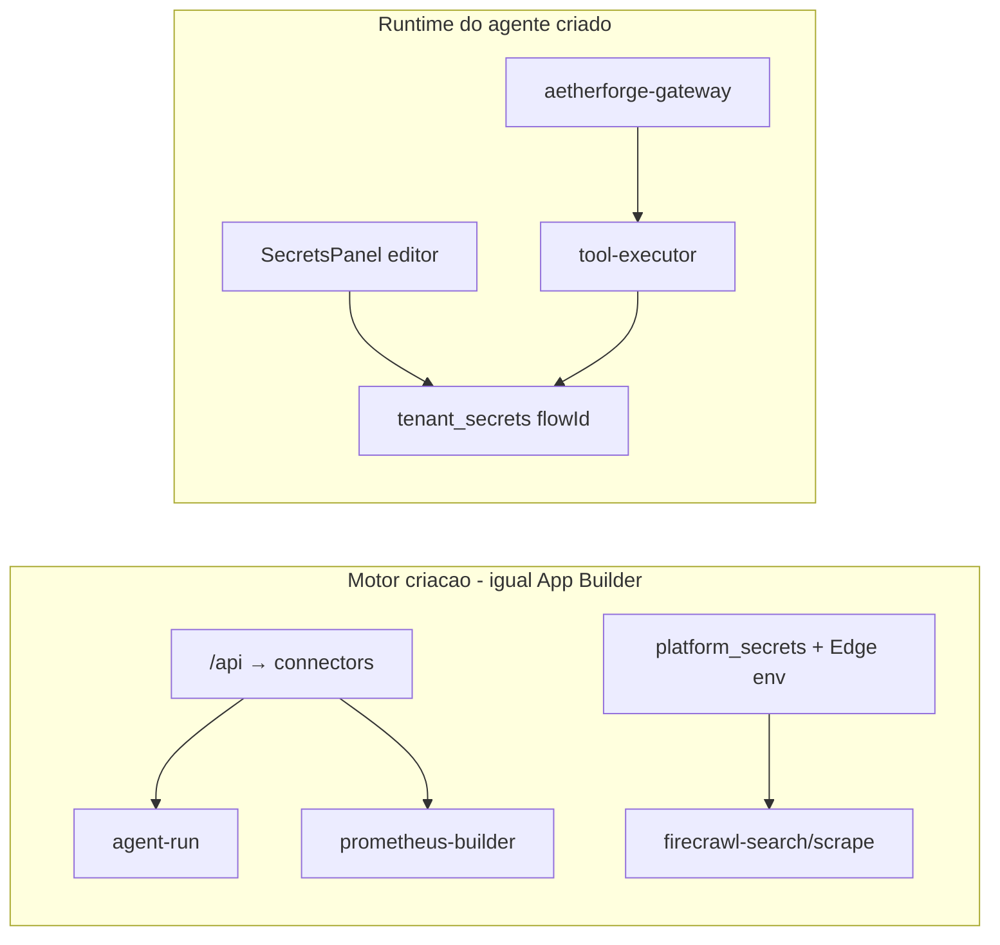

# Plano qualificado v2 — AetherForge no FORGE

> Plano v2 com contexto dos 5 subagentes: secrets (`connectors`=motor, `tenant_secrets`=agente), 20 tarefas atómicas (1/sessão), gaps P0 confirmados em código, e adaptações FORGE explícitas.

**Regra:** 1 tarefa = 1 sessão. Nunca duas na mesma sessão.  
**Fonte read-only:** `vibrant-visionary-craft1` (Lovable / Direito Prático)  
**Destino:** este repositório (`dreaming-doing`)  
**Requisitos originais:** [`AETHERFORGE-EXPORT-CTRL-C-V-REQUISITOS.md`](./AETHERFORGE-EXPORT-CTRL-C-V-REQUISITOS.md)  
**Supabase ref:** `dpduljngdurfpmaclffa`

---

## Modelo de secrets (confirmado em código)



| O quê | Onde | Exemplos |
|-------|------|----------|
| **Motor** LLM + infra | [`src/routes/api.tsx`](../src/routes/api.tsx) → `connectors` via [`connector-keys.ts`](../supabase/functions/agent-run/connector-keys.ts) | GROQ, OpenRouter, Anthropic, E2B, Ollama |
| **Motor** pesquisa | Edge + `platform_secrets` via [`getPlatformSecret`](../supabase/functions/_shared/platform-secrets.ts) | `FIRECRAWL_API_KEY` |
| **Agente** operação | [`SecretsPanel`](../src/components/forge-agents/flow-builder/SecretsPanel.tsx) → `tenant_secrets` (`tenant_id` = `flowId`) | RESEND, TWILIO, FIRECRAWL do cliente |

**Gaps resolvidos (T01–T14):**

- Prometheus `routeLLM` passa `tenant_id: userId` → connectors do `/api` (T10, T11)
- Alias `GEMINI_API_KEY` → `GOOGLE_AI_API_KEY`; `NVIDIA_API_KEY` per-model (T10)
- `SecretsPanel` BYOK + RLS por ownership do `agent_flow` (T01, T02)
- Firecrawl motor via `getPlatformSecret` (T12)
- Prompt dashboard → Postgres + reutilização de draft (T15–T17)

---

## P0 blockers (evidência original → estado)

| # | Gap | Evidência | Estado |
|---|-----|-----------|--------|
| 1 | BYOK cols missing | SecretsPanel vs migration `20260615003` | ✅ T01 |
| 2 | RLS wrong (`tenant_id = auth.uid()`) | migration L66-70 | ✅ T02 |
| 3 | `canary_version_id` missing | gateway SELECT | ✅ T03 |
| 4 | `quality_model` missing | cortex, builder | ✅ T04 |
| 5 | 38 tools missing in registry | só 4 `kg_*` | ✅ T05 |
| 6 | `firecrawl-scrape` missing | prometheus-tools `fetch_page` | ✅ T08 |
| 7 | Prompt dashboard → DB, UI lê localStorage vazio | AdminAgentBuilderView | ✅ T15–T16 |

---

## 20 tarefas (ordem de prioridade)

### Bloco A — Schema + tenant_secrets do agente

**T01 — Migration BYOK `tenant_secrets`**

- Migration: `supabase/migrations/20260616000001_tenant_secrets_byok.sql`
- Colunas: `provider_id`, `is_platform_provided`, `secret_type`, `description` + index
- **Verificar:** INSERT no SecretsPanel sem erro SQL

**T02 — RLS `tenant_secrets` por ownership do flow**

- Migration: `supabase/migrations/20260616000002_tenant_secrets_rls_agent_flows.sql`
- `tenant_id IN (SELECT id FROM agent_flows WHERE user_id = auth.uid())`
- **Contexto:** `tenant_id` = `flowId` ([`executor-tool.ts`](../supabase/functions/_shared/executor-tool.ts) L20)

**T03 — Migration `canary_version_id`**

- Migration: `supabase/migrations/20260616000003_add_canary_version_id.sql`

**T04 — Migrations `quality_model` + `fallback_model_id`**

- Migration: `supabase/migrations/20260616000004_prometheus_quality_model.sql`

**T05 — Batch seeds `tool_registry`**

- Migration: `supabase/migrations/20260616000005_tool_registry_batch.sql`
- Exclui: jurídico, calendar (edge `calendar-tools` inexistente no FORGE)
- **Verificar:** `SELECT count(*) FROM tool_registry` ≥ 42

**T06 — Migration `tool_circuit_breaker_state`**

- Migration: `supabase/migrations/20260616000006_tool_circuit_breaker_state.sql`

**T07 — `db push` + regenerar `types.ts`**

- Aplicar T01–T06 no `dpduljngdurfpmaclffa`

---

### Bloco B — Edge Prometheus

**T08 — Copiar `firecrawl-scrape`**

- `supabase/functions/firecrawl-scrape/`
- Scripts: `port-aetherforge-backend.sh`, `sync/deploy-all.sh`
- `config.toml`: `[functions.firecrawl-scrape] verify_jwt = false`

**T09 — Deploy `firecrawl-scrape` + smoke**

```bash
curl -X POST "$SUPABASE_URL/functions/v1/firecrawl-scrape" \
  -H "Authorization: Bearer $SERVICE_KEY" \
  -d '{"url":"https://example.com","options":{"formats":["markdown"],"onlyMainContent":true}}'
```

---

### Bloco C — Motor Prometheus → connectors

**T10 — Bridge connectors → `llm-router`**

- [`connector-llm-bridge.ts`](../supabase/functions/_shared/connector-llm-bridge.ts)
- [`llm-router.ts`](../supabase/functions/_shared/llm-router.ts) `resolveApiKey`: connectors quando `tenantId === userId`

**T11 — `tenant_id: userId` em todo Prometheus `routeLLM`**

- `prometheus-cortex.ts`, analyst, architect, scribe, sentinel, deliberation, react-loop, codex, report
- `prometheus-builder/index.ts`

**T12 — Firecrawl via `getPlatformSecret`**

- `firecrawl-search`, `firecrawl-scrape`

---

### Bloco D — Editor do agente

**T13 — SecretsPanel: só keys de operação do agente**

- Remover checklist LLM providers (já em `/api`)
- Fix `GraduationGate.tsx`: `GOOGLE_AI_API_KEY`, NVIDIA per-model

**T14 — `/api` secção compacta infra do motor**

- `src/routes/api.tsx`: FIRECRAWL + keys do motor Prometheus

---

### Bloco E — Frontend: um caminho só

**T15 — Hidratar prompt da dashboard → Prometheus**

- `projects.functions.ts`: `flow_definition.briefing.prompt` no draft
- `AdminAgentBuilderView.tsx`: `initialPrompt` + upsert draft em `handleLaunch`
- `routes/agents/$agentId/index.tsx`

**T16 — Limpar localStorage órfão**

- `prometheus-pipeline-storage.ts`: só `ps_{field}_{projectId}`

**T17 — Fluxo único criar agente**

- PromptEngine / CreateAgentDialog → `/agents/$id` → Prometheus
- `agent_flows.project_id` sempre preenchido; um draft por projeto
- Helper: `src/lib/agent-project-draft.ts`
- Índice único: `20260615220000_agent_flows_one_draft_per_project.sql`

---

### Bloco F — Validação + documentação

**T18 — Smoke Prometheus**

```bash
npm run smoke:prometheus          # gateway + prometheus-builder + cortex turn
npm run smoke:aetherforge         # só gateway
node scripts/smoke-prometheus-e2e.mjs
```

Valida: `firecrawl-search` / `firecrawl-scrape` (motor), `prometheus-builder` start com JWT, ≥1 turno cortex.

**T19 — Smoke gateway tool + tenant_secrets**

```bash
npm run smoke:gateway-tools
# com chave Resend real:
SMOKE_RESEND_API_KEY=re_xxx npm run smoke:gateway-tools
```

Flow `trigger → tool(email_send)` + `tenant_secrets.RESEND_API_KEY` no `flowId`.  
Pass: registry hit + secret injetado + execução (chega na API Resend).

**T20 — Este documento**

- `docs/AETHERFORGE-PARIDADE-PLANO.md`

---

## Adaptações FORGE (manter — não vibrant)

| Item | Vibrant | FORGE |
|------|---------|-------|
| `code_execute` | E2B em tool-executor | E2B; chave motor em `/api` connectors |
| Gateway executor | KVM8 :8890 primeiro | inline BFS only |
| STT site/mic | vps-whisper | `voice-transcribe` (Groq/xAI/OpenRouter) |
| STT nó gateway | KVM8 Whisper | env `VPS_VOICE_URL` (opcional v1) |
| `agent_flows.project_id` | não existe | FK → `projects` |
| Celery Ollama | sim | `OLLAMA_URL` direct |
| Calendar tools (4) | edge `calendar-tools` | **deferir** |

---

## O que NÃO fazer

- Não tocar `agent-run/` exceto import `connector-keys` em bridge (T10)
- Não escrever no vibrant
- Não reescrever `rag_search` sem ordem
- Não portar seeds jurídicos
- Não executar 2+ tarefas por sessão

---

## Como executar (referência histórica)

Diz **"executa T01"** → só migration BYOK. Depois **"executa T02"** → só RLS. E assim por diante.

## Checklist

- [x] **T01** — Migration BYOK tenant_secrets
- [x] **T02** — RLS tenant_secrets por agent_flows ownership
- [x] **T03** — Migration canary_version_id
- [x] **T04** — Migrations quality_model + fallback_model_id
- [x] **T05** — Batch tool_registry 38 tools + model_id UPDATEs
- [x] **T06** — Migration tool_circuit_breaker_state
- [x] **T07** — db push + regenerar types.ts
- [x] **T08** — Copiar firecrawl-scrape + scripts + config.toml
- [x] **T09** — Deploy firecrawl-scrape + smoke curl
- [x] **T10** — connector-llm-bridge + llm-router resolveApiKey
- [x] **T11** — tenant_id userId em todos routeLLM Prometheus
- [x] **T12** — Firecrawl getPlatformSecret
- [x] **T13** — SecretsPanel só ops agente + GraduationGate fix
- [x] **T14** — /api secção compacta FIRECRAWL infra
- [x] **T15** — Hidratar prompt dashboard + reutilizar draft flow
- [x] **T16** — Limpar localStorage vibrant órfão
- [x] **T17** — Fluxo único criar agente
- [x] **T18** — Smoke Prometheus e2e
- [x] **T19** — Smoke gateway + tenant_secrets tool
- [x] **T20** — Gravar docs/AETHERFORGE-PARIDADE-PLANO.md

---

## Scripts de smoke (resumo)

| Script | npm | O que valida |
|--------|-----|--------------|
| `scripts/smoke-aetherforge-e2e.mjs` | `smoke:aetherforge` | Gateway healthz + action `test` |
| `scripts/smoke-prometheus-e2e.mjs` | `smoke:prometheus` | T18: Firecrawl motor + cortex turn |
| `scripts/smoke-gateway-tenant-secrets-e2e.mjs` | `smoke:gateway-tools` | T19: tool única (`--tool=email_send`) |
| `scripts/smoke-gateway-tenant-secrets-e2e.mjs` | `smoke:gateway-matrix` | T29: matriz (`web_scrape`, `http_request`, `web_research`, `condition_eval`, `email_send`) |
| `scripts/smoke-gateway-inngest-e2e.mjs` | `smoke:gateway-inngest` | T32: slug → Inngest → `execute_step` → completed |
| `scripts/smoke-agent-e2e.mjs` | `smoke:agent` | Inngest agent-run |
| `scripts/smoke-queue-e2e.mjs` | `smoke:queue` | Fila `agent_pending_messages` |

---

## Fase 2 — Runtime + UX (pós-T20)

### Bloco G — Tool executor (P0)

- [x] **T21** — `web_scrape` / `web_research` agnósticos (`web-research-providers.ts`, cases unificados em `tool-executor.ts`)
- [x] **T22** — Dispatch `executor_type: edge_function` → `functions/v1/{function_name}`
- [x] **T23** — `prometheus-healer` passa `tenant_id: userId` em todos os `routeLLM`
- [x] **T24** — Removido `ollama-worker-client.ts` (Ollama = connector HTTP)

### Bloco H — Gateway runtime

- [x] **T25** — Nós loop/delay/transformer/error_handler/switch + `rag_search` real (`executor-data.ts`, `gateway-bfs.ts`)
- [x] **T26** — Gateway long-running via Inngest (`gateway-inngest.ts`, `action=execute_step`, `src/inngest/functions/gateway-flow.ts`)
- [x] **T27** — Builtins implícitos + migration `20260616000007_tool_registry_implicit_builtins.sql`

### Bloco I — Validação

- [x] **T28** — Health check no editor (`action=test_tool`, SecretsPanel + ToolConfig)
- [x] **T29** — Matriz smoke: `npm run smoke:gateway-matrix` (`--tool=all`)

### Bloco J — Frontend fluxo

- [x] **T30** — Dashboard `initialPrompt` → boardroom direto (sem PrometheusHome duplicado)
- [x] **T31** — Removido `handleOnboardingComplete` + `AgentFlowCard.tsx`

### Bloco K — Gateway produção (Inngest)

- [x] **T32** — Smoke slug → Inngest → `execute_step` (`scripts/smoke-gateway-inngest-e2e.mjs`, `npm run smoke:gateway-inngest`)
- [x] **T33** — `agent_execution_steps.node_id` TEXT + `gateway-flow` concurrency ≤5 (limite plano Inngest)

---

## Débitos conhecidos pós-paridade

- **Firecrawl motor:** configurar `FIRECRAWL_API_KEY` em `/api` para pesquisa real no Prometheus (smoke T18 avisa se ausente). **Não é blocker** para `web_scrape` do agente (fallback Jina/HTTP).
- **Calendar tools (4):** deferidos até portar edge `calendar-tools` (dispatch T22 já pronto).
- **Gateway produção:** slug → Inngest `aetherforge/flow.execute` → worker `gateway-flow-execute` (Vercel `/api/inngest`). Concurrency máx. **5** (plano Inngest). Smoke: `npm run smoke:gateway-inngest -- --strict-inngest`.