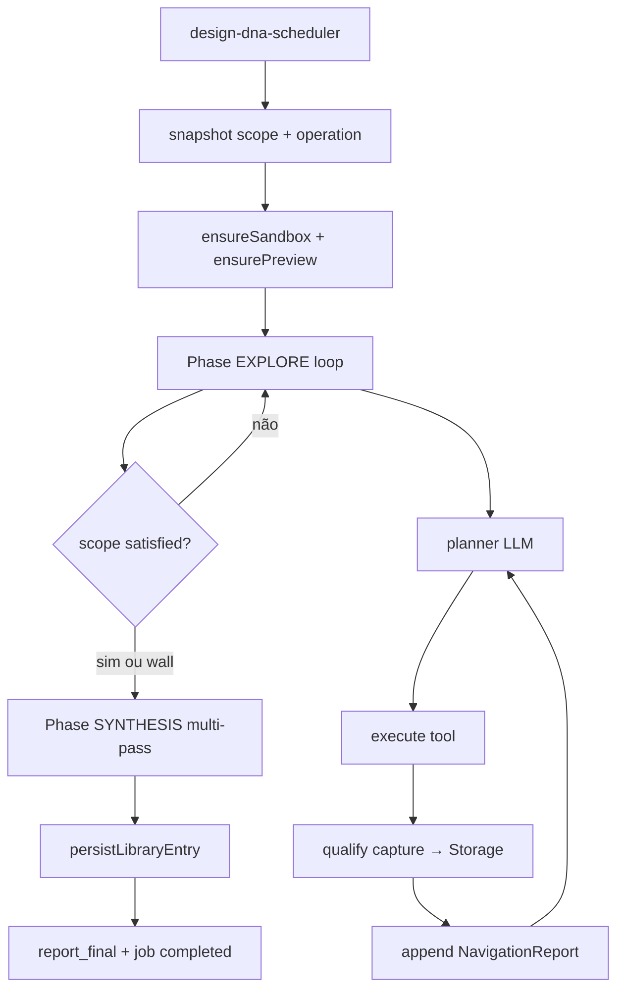

# SPEC CANÔNICA — DEEP Capture, Escopo e Navigation Report

**Versão:** 1.0  
**Status:** Fonte única de verdade para modo DEEP (captura + evidência + síntese)  
**Pai:** `docs/DESIGN_DNA_CANONICAL_SPEC.md` (produto, gates G0–G8, SHALLOW/DEEP macro)  
**Substitui:** decisões ad-hoc sobre teto de prints, base64 no LLM, e síntese monolítica no agente DEEP.

---

## 0. Como usar este documento (autoguiado)

Este spec é **máquina de implementação**. Um agente ou dev deve seguir **na ordem**, sem reinterpretar requisitos.

### 0.1 Protocolo de sessão

```
1. Ler §1–§3 (leis + contratos) — não pular
2. Identificar último gate PASS em §9
3. Executar apenas o próximo PR do DAG em §10
4. Rodar checklist do gate correspondente
5. Marcar gate PASS/FAIL neste arquivo (§9.3) ou em commit message: "G-CAP-N: pass"
6. Não iniciar PR+1 se gate anterior FAIL
```

### 0.2 Regra de ouro (inviolável)

```
PIXELS ≠ PROMPT
```

- Captura gera **arquivos** (Storage) + **metadados** (DB).
- LLM recebe **texto estruturado** + **vision orçada** (1–2 thumbs por chamada).
- **Nunca** base64 em `observation`, `formatStepsForPrompt`, ou corpo de mensagem textual.

### 0.3 O que este doc cobre / não cobre

| Dentro | Fora |
|--------|------|
| Escopo-driven captures qualificados | SHALLOW (ver spec pai §3.2) |
| Navigation Report | VibeCoding `design_resolve` |
| Storage + `design_dna_captures` | Rewrite do Refero router em produção paralela |
| Multi-pass síntese com `captureIds` | UI completa da galeria (gate posterior) |
| Integração chat → `design_dna_instructions` → scope | Migração de dados legados |

---

## 1. Experiência alvo (DEEP)

### 1.1 Referência de produto

O usuário espera qualidade **Refero-class**: muitos prints **qualificados** (ex.: Lovable com 200+), cada um com rótulo e contexto — **não** uma página inteira renderizada como Figma infinito.

### 1.2 Reality Show (inalterável — spec pai §1.1)

1. Preview noVNC = browser real (`previewUrl` → `/vnc.html?autoconnect=true&resize=scale&reconnect=true`, porta `6080`).
2. Chat = espelho do agente + instruções do usuário (`design_dna_instructions`).
3. Galeria de captures cresce durante o job (thumbs qualificados).
4. Navigation Report parcial durante o job; report final ao terminar.
5. Termina com entrada em `design_system_library` **ou** falha legível.

### 1.3 Escopo é o produto

- Quantidade de prints **não** tem teto fixo de produto (não usar 5, 12, etc. como regra).
- Quantidade é limitada por **`ExtractionScope`** + **`wallMs`** (`packages/agent-contract/src/operation.ts`).
- Chat expande escopo em runtime: *"100% do site mapeado"* → mais páginas, mais dobras, mais captures.

### 1.4 Default operacional — Scope Level 7

Todo job DEEP inicia com:

```typescript
const DEFAULT_EXTRACTION_SCOPE: ExtractionScope = {
  level: 7,
  intent: "landing",
  pages: "single",
  folds: "auto",           // todas as dobras detectadas na landing
  viewports: ["desktop"],
  categories: ["hero", "motion", "typography", "color_application", "components", "interactions"],
  capturePolicy: {
    minQualifiedCaptures: 3,
    maxCaptures: null,     // sem teto hard; wallMs é o fusível
    qualifyEach: true,
  },
  reportPolicy: {
    partialEveryNCaptures: 10,
    finalReport: true,
  },
};
```

Level 7 ≠ poucos prints. Uma landing longa pode gerar 15–40 captures qualificados. Level 10 + HOTL pode gerar 100–300+.

---

## 2. Arquitetura em três camadas

```
┌─────────────────────────────────────────────────────────────┐
│ CAMADA 1 — CAPTURA (máxima fidelidade, sem limite artificial)│
│  CDP/Playwright → segmento viewport → Storage (WebP)        │
│  → design_dna_captures (metadados + qualificação)           │
└───────────────────────────┬─────────────────────────────────┘
                            │
┌───────────────────────────▼─────────────────────────────────┐
│ CAMADA 2 — EVIDÊNCIA (texto, acumulativo)                    │
│  analyze, CSS, seções DOM, notas do agente                  │
│  → NavigationReport (partial + final)                       │
└───────────────────────────┬─────────────────────────────────┘
                            │
┌───────────────────────────▼─────────────────────────────────┐
│ CAMADA 3 — INTELIGÊNCIA (LLM orçado)                         │
│  Planner: 1 thumb + histórico sanitizado                      │
│  Síntese: multi-pass + 0–2 imagens/pass via captureId       │
│  → design_dna JSON → design_system_library                  │
└─────────────────────────────────────────────────────────────┘
```

### 2.1 Diagrama de fluxo do job



---

## 3. Leis do sistema (invariantes)

| ID | Lei | Violação = |
|----|-----|------------|
| L1 | `formatStepsForPrompt` nunca serializa base64 | Gate G-CAP-1 FAIL |
| L2 | `observation` após capture contém só `captureId` + metadados | G-CAP-2 FAIL |
| L3 | Planner recebe ≤1 imagem vision por chamada (thumb ≤800px WebP) | G-CAP-3 FAIL |
| L4 | Síntese recebe ≤2 imagens por pass multi-pass | G-CAP-7 FAIL |
| L5 | Todo capture persistido tem `qualification.label` não vazio | G-CAP-5 FAIL |
| L6 | `screenshot` e `screenshot fullPage` não são deprecados — redirecionam para pipeline qualificado | review reject |
| L7 | Escopo só muda via `design_dna_instructions` ou snapshot inicial — não relê `profiles` mid-run | spec pai operation.ts |
| L8 | Full-page único nunca vai para LLM; vira `capture_page_segments` | G-CAP-4 FAIL |

---

## 4. Contratos TypeScript (SSOT)

**Pacote alvo:** `packages/agent-contract/src/deep-capture.ts`  
**Sync:** `npm run sync:agent-contract` → `supabase/functions/_shared/agent-contract-deep-capture.ts`  
**Executor:** `src/inngest/executor/deep-capture/` (implementação)

### 4.1 `ExtractionScope`

```typescript
export type ScopeIntent = "landing" | "full_site" | "curated" | "custom";
export type ScopePages = "single" | "sitemap" | "user_list";
export type ScopeFolds = "auto" | "all" | "hero_only";

export type ExtractionScope = {
  level: number;
  intent: ScopeIntent;
  pages: ScopePages;
  folds: ScopeFolds;
  viewports: Array<"desktop" | "tablet" | "mobile">;
  categories: string[];
  pageUrls?: string[];
  excludeSelectors?: string[];
  capturePolicy: {
    minQualifiedCaptures: number;
    maxCaptures: number | null;
    qualifyEach: true;
  };
  reportPolicy: {
    partialEveryNCaptures: number;
    finalReport: true;
  };
};
```

### 4.2 `QualifiedCapture` (linha DB + tipo)

```typescript
export type QualifiedCapture = {
  id: string;
  jobId: string;
  pageUrl: string;
  pageIndex: number;
  segmentIndex: number;
  scrollY: number;
  viewport: { width: number; height: number; label: string };
  qualification: {
    sectionType: string;
    label: string;
    selector?: string;
    confidence: number;
  };
  storagePath: string;
  thumbPath: string;
  byteSize: number;
  createdAt: string;
};
```

### 4.3 `NavigationReport`

```typescript
export type NavigationReport = {
  jobId: string;
  version: number;
  scope: ExtractionScope;
  pagesVisited: Array<{
    url: string;
    title: string;
    foldsCaptured: number;
    sections: Array<{ type: string; label: string; captureId: string }>;
  }>;
  capturesQualified: number;
  highlights: string[];
  motionObservations: string[];
  typographyNotes: string[];
  colorNotes: string[];
  componentInventory: string[];
  gaps: string[];
  userInstructionsApplied: string[];
  updatedAt: string;
};
```

### 4.4 `AgentObservation` (pós G-CAP-2)

```typescript
export type CaptureObservation = {
  type: "capture";
  captureId: string;
  pageUrl: string;
  scrollY: number;
  qualification: QualifiedCapture["qualification"];
  byteSize: number;
  timestamp: string;
};

// Proibido: observation.screenshot: string (base64)
// Proibido: observation.result.base64 em histórico do planner
```

### 4.5 Scope levels (tabela de referência)

| Level | Intent | Pages | Prints típicos |
|-------|--------|-------|----------------|
| 3 | landing | single | 2–4 |
| 5 | landing | single | 8–15 |
| **7** | **landing** | **single** | **15–40** |
| 9 | full_site | sitemap | 50–120 |
| 10 | full_site | sitemap + HOTL | 100–300+ |

---

## 5. Modelo de dados

### 5.1 Nova tabela `design_dna_captures`

```sql
CREATE TABLE public.design_dna_captures (
  id            uuid PRIMARY KEY DEFAULT gen_random_uuid(),
  job_id        uuid NOT NULL REFERENCES public.design_dna_jobs(id) ON DELETE CASCADE,
  page_url      text NOT NULL,
  page_index    int NOT NULL DEFAULT 0,
  segment_index int NOT NULL DEFAULT 0,
  scroll_y      int NOT NULL DEFAULT 0,
  viewport_label text NOT NULL DEFAULT 'desktop',
  section_type  text NOT NULL DEFAULT 'unknown',
  label         text NOT NULL,
  selector      text,
  confidence    real NOT NULL DEFAULT 0,
  storage_path  text NOT NULL,
  thumb_path    text NOT NULL,
  byte_size     int NOT NULL DEFAULT 0,
  meta          jsonb NOT NULL DEFAULT '{}',
  created_at    timestamptz NOT NULL DEFAULT now()
);

CREATE INDEX idx_design_dna_captures_job ON public.design_dna_captures(job_id, segment_index);
ALTER TABLE public.design_dna_captures ENABLE ROW LEVEL SECURITY;
-- RLS: owner via design_dna_jobs.user_id (mesmo padrão design_dna_events)
ALTER PUBLICATION supabase_realtime ADD TABLE public.design_dna_captures;
```

### 5.2 Extensões `design_dna_jobs.meta`

```typescript
{
  scope: ExtractionScope;
  navigationReport: NavigationReport;
  captureStats: { qualified: number; rejected: number; pages: number };
  previewUrl: string;
  operation: RunOperationMeta;
}
```

### 5.3 Storage (bucket `design-dna-captures`)

```
jobs/{jobId}/captures/{captureId}.webp      # full viewport
jobs/{jobId}/thumbs/{captureId}.webp          # max 800px — único permitido no LLM
```

---

## 6. Tools CDP (comportamento canônico)

| Tool | Comportamento | Destino |
|------|---------------|---------|
| `navigate` | goto + load | report.pagesVisited |
| `scroll` | scrollY | posiciona próximo segmento |
| `click` / `type` | interação | report highlights |
| `analyze` | CSS/DOM estruturado | report + evidência síntese |
| `evaluate` | JS → JSON | report |
| `screenshot` | **→ `capture_viewport`** | Storage + qualify |
| `screenshot fullPage=true` | **→ `capture_page_segments`** | N captures qualificados |
| `capture_section` (novo) | selector → 1 capture | Storage + qualify |
| `discover_pages` (novo) | links internos | scope `user_list` / sitemap |

### 6.1 `capture_page_segments` (substitui full-page no LLM)

Reusar lógica de `src/inngest/executor/refero/refero-router.ts` (scroll segments + viewport), generalizada:

```
scrollHeight, viewportHeight = medidas DOM
numSegments = ceil(scrollHeight / viewportHeight)
para i em 0..numSegments-1:
  scrollTo(i * viewportHeight)
  capture viewport → qualify → Storage
```

**Não** gerar um único PNG full-page para memória do agente.

### 6.2 Qualificação obrigatória (`qualifyEach: true`)

Por capture:

1. Heurística DOM (`SectionData` — tipo hero/features/pricing/…).
2. LLM leve (texto + thumb): `{ label, sectionType, worthKeeping, notes }`.
3. Se `worthKeeping` → INSERT `design_dna_captures` + evento `capture_qualified`.
4. Senão → evento `capture_rejected` (não conta para mínimo).

---

## 7. LLM — contratos de chamada

### 7.1 Planner (cada step do loop)

| Campo | Conteúdo |
|-------|----------|
| system | objetivo + scope + categorias + instruções + `formatStepsForPrompt(sanitized)` |
| user | `"Qual o próximo passo?"` |
| vision | 0–1 thumb URL (signed, 800px) |

**Proibido:** base64 inline; histórico com `screenshot` field.

### 7.2 Qualificador (por capture)

| Campo | Conteúdo |
|-------|----------|
| input | thumb + sectionType candidato + URL + scrollY |
| output | JSON `{ label, sectionType, worthKeeping, notes }` |

### 7.3 Síntese — multi-pass

Reusar `src/inngest/executor/refero/llm-multi-pass.ts`:

| Pass | Texto primário | Vision |
|------|----------------|--------|
| hero | report.highlights + sections hero | captureIds hero (≤2) |
| typography | report.typographyNotes | 1 capture com texto |
| color_application | report.colorNotes + palette | ≤2 captures |
| motion | report.motionObservations | ≤2 captures |
| components | componentInventory | ≤2 captures |
| interactions | interaction notes | 1 capture |
| synthesis | merge passes | 0 imagens |

Resolver imagens via signed URL do Storage — **nunca** base64 no request body textual.

### 7.4 Vision budget (global por job)

| Chamada | Max imagens | Max pixels long edge |
|---------|-------------|----------------------|
| planner | 1 | 800 |
| qualify | 1 | 400 |
| multi-pass pass | 2 | 800 |
| synthesis merge | 0 | — |

---

## 8. Eventos (`design_dna_events`)

| event_type | Quando | payload mínimo |
|------------|--------|------------------|
| `capture_qualified` | capture aceito | `captureId`, `label`, `thumbUrl`, `pageUrl` |
| `capture_rejected` | rejeitado | `reason`, `pageUrl` |
| `report_partial` | a cada N captures | `version`, `highlights[]`, `capturesQualified` |
| `report_final` | job terminal | `NavigationReport` resumido |
| `scope_updated` | instrução mudou escopo | `ExtractionScope` diff |
| `agent_thought` | existente | — |
| `agent_action` | existente | — |
| `agent_observation` | existente | **sanitized only** |

---

## 9. Gates bloqueantes

### 9.1 Mapa de gates

| Gate | Nome | PRs | Critério PASS |
|------|------|-----|---------------|
| G-CAP-0 | Baseline | — | Preview noVNC OK (`/vnc.html`) |
| G-CAP-1 | Histórico sanitizado | PR-1 | Job não morre HTTP 400 após screenshot step |
| G-CAP-2 | Captures em Storage | PR-2 | 0 bytes base64 em observations persistidas |
| G-CAP-3 | Scope snapshot | PR-3 | `meta.scope.level === 7` no start |
| G-CAP-4 | Segmentação | PR-4 | `fullPage` gera ≥3 captures em página longa |
| G-CAP-5 | Qualificação | PR-5 | 100% captures com `label` não vazio |
| G-CAP-6 | Navigation Report | PR-6 | `report_partial` + `report_final` no chat |
| G-CAP-7 | Síntese multi-pass | PR-7 | DNA 6 categorias sem HTTP 400 |
| G-CAP-8 | UI galeria | PR-8 | ≥10 thumbs visíveis durante job DEEP |

### 9.2 Gate G-CAP-1 (critério detalhado — destrava produção)

Job DEEP `https://livekit.com/` scope level 7:

- [ ] navigate + click + screenshot **não** geram HTTP 400
- [ ] planner step 4+ executa
- [ ] `formatStepsForPrompt` output não contém substring `iVBOR` (base64 PNG)

### 9.3 Gate G-CAP-7 (critério detalhado — produto completo)

- [ ] `design_system_library` row com `design_dna` preenchido
- [ ] `capturesQualified >= scope.capturePolicy.minQualifiedCaptures`
- [ ] `navigationReport.final` presente
- [ ] `provider_trace` contém `cdp:sandbox-playwright`

### 9.4 Registro de progresso (atualizar a cada sessão)

| Gate | Status | Data | Commit |
|------|--------|------|--------|
| G-CAP-0 | PASS | 2026-07-02 | ebd55bf |
| G-CAP-1 | PASS | 2026-07-02 | b0afe28 |
| G-CAP-2 | PASS | 2026-07-02 | 59473a6 |
| G-CAP-3 | PASS | 2026-07-02 | bcd43f7 |
| G-CAP-4 | PASS | 2026-07-02 | (PR-4 commit) |
| G-CAP-5 | PASS | 2026-07-02 | bf90d14 |
| G-CAP-6 | PASS | 2026-07-02 | 2a8f37d |
| G-CAP-7 | PASS | 2026-07-02 | d67e6db |
| G-CAP-8 | FAIL | — | — |

---

## 10. DAG de implementação (PRs)

```
PR-1 ──► G-CAP-1
          │
PR-2 ──► G-CAP-2
          │
PR-3 ──► G-CAP-3
          │
PR-4 ──► G-CAP-4
          │
PR-5 ──► G-CAP-5
          │
PR-6 ──► G-CAP-6
          │
PR-7 ──► G-CAP-7
          │
PR-8 ──► G-CAP-8
```

### PR-1 — Sanitização SSOT (hotfix)

| Item | Detalhe |
|------|---------|
| Arquivos | `browser-agent-state.ts`, `browser-agent-synthesis.ts` |
| Ação | Extrair `sanitizeObservationForEvidence` → `deep-capture/sanitize.ts`; usar em `formatStepsForPrompt` + síntese |
| Testes | `browser-agent-state.test.ts`, `browser-agent-synthesis.test.ts` |
| Não fazer | Upload Storage ainda |

### PR-2 — Storage + tabela captures

| Item | Detalhe |
|------|---------|
| Arquivos | migration `design_dna_captures`, `capture-storage.ts`, `browser-agent-runner.ts` |
| Ação | Após screenshot tool: upload WebP, observation = `CaptureObservation` |
| Testes | upload mock, observation shape |

### PR-3 — ExtractionScope

| Item | Detalhe |
|------|---------|
| Arquivos | `packages/agent-contract/src/deep-capture.ts`, scheduler, `run-design-dna.ts` |
| Ação | Snapshot default level 7; parser de instructions → `scope_updated` |
| Testes | scope parser fixtures |

### PR-4 — Segmentação Refero-style

| Item | Detalhe |
|------|---------|
| Arquivos | `sandbox-cdp-driver.py`, `browser-cdp-tools.ts` |
| Ação | `capture_page_segments` action; `fullPage` redireciona para segmentos |
| Testes | página mock altura 4000px → ≥4 segments |

### PR-5 — Qualificação

| Item | Detalhe |
|------|---------|
| Arquivos | `capture-qualify.ts`, `browser-agent-runner.ts` |
| Ação | LLM leve pós-capture; reject/accept |
| Testes | worthKeeping true/false |

### PR-6 — Navigation Report

| Item | Detalhe |
|------|---------|
| Arquivos | `navigation-report.ts`, `run-design-dna.ts`, events |
| Ação | Acumular partial; `appendOperationReport` se HOTL |
| Testes | version increment, partial cadence |

### PR-7 — Síntese multi-pass + captureIds

| Item | Detalhe |
|------|---------|
| Arquivos | `run-deep-extraction.ts` (novo ou fundir runner), `llm-multi-pass.ts` |
| Ação | Substituir `browser-agent-synthesis` monolítico; signed URLs |
| Testes | multi-pass com capture fixtures |

### PR-8 — UI galeria + report

| Item | Detalhe |
|------|---------|
| Arquivos | `BrowserPreviewPanel.tsx`, `hooks.ts` |
| Ação | Realtime `design_dna_captures`; tab Report |
| Testes | componente galeria |

---

## 11. Mapa de arquivos (tocar / não tocar)

### 11.1 Criar

| Arquivo |
|---------|
| `packages/agent-contract/src/deep-capture.ts` |
| `src/inngest/executor/deep-capture/sanitize.ts` |
| `src/inngest/executor/deep-capture/capture-storage.ts` |
| `src/inngest/executor/deep-capture/capture-qualify.ts` |
| `src/inngest/executor/deep-capture/navigation-report.ts` |
| `src/inngest/executor/deep-capture/scope-parser.ts` |
| `src/inngest/executor/run-deep-extraction.ts` |
| `supabase/migrations/*_design_dna_captures.sql` |

### 11.2 Modificar

| Arquivo | PR |
|---------|-----|
| `browser-agent-state.ts` | PR-1, PR-2 |
| `browser-agent-runner.ts` | PR-2, PR-5, PR-6 |
| `browser-cdp-tools.ts` | PR-4 |
| `sandbox-cdp-driver.py` | PR-4 |
| `run-design-dna.ts` | PR-3, PR-7 |
| `design-dna-preview.ts` | G-CAP-0 (feito) |
| `BrowserPreviewPanel.tsx` | PR-8 |

### 11.3 Não deprecar

| Arquivo | Motivo |
|---------|--------|
| `browser-cdp-tools.ts` | Tools permanecem; comportamento redireciona |
| `refero/refero-router.ts` | Funções de segmentação/CSS import pontual |
| `llm-multi-pass.ts` | Motor de síntese canônico |
| `design_dna_instructions` | Escopo runtime |

### 11.4 Deletar após G-CAP-7 PASS

| Arquivo | Condição |
|---------|----------|
| `browser-agent-synthesis.ts` | Substituído por multi-pass + report |
| Duplicação base64 em qualquer observation | Zero referências grep |

---

## 12. Integração chat → escopo

### 12.1 Frases → mutação de scope

| Input usuário | Mutação |
|---------------|---------|
| "100% do site" / "mapeia tudo" | `intent=full_site`, `pages=sitemap`, `level=10` |
| "só hero" | `folds=hero_only`, `categories=["hero"]` |
| "inclui /pricing" | `pages=user_list`, append `pageUrls` |
| "ignora footer" | append `excludeSelectors: ["footer"]` |
| "adiciona mobile" | append `viewports: ["mobile"]` |

Parser: `scope-parser.ts` — LLM estruturado ou regex+LLM; resultado → `design_dna_instructions` role=system + evento `scope_updated`.

### 12.2 Consumo no loop

```
fetchInstructions → parseScopeUpdates → merge meta.scope → planner reads snapshot
```

---

## 13. Anti-padrões (rejeitar em review)

| Anti-padrão | Correção |
|-------------|----------|
| Teto fixo 5/12 prints no código | Usar `ExtractionScope` + `wallMs` |
| `JSON.stringify(observation)` com pixels | `sanitizeObservationForEvidence` |
| fullPage → 1 PNG no state | `capture_page_segments` |
| 200 imagens num LLM call | multi-pass + captureIds |
| Deprecar tool `screenshot` | Redirecionar comportamento |
| Reler `profiles.agent_preferences` no loop | Só `meta.operation` + `meta.scope` snapshot |
| Preview em `:9222` ou raiz `:6080/` | `/vnc.html?autoconnect=true&...` |

---

## 14. Verificação automática (comandos)

```bash
# Após cada PR
npm run test -- src/inngest/executor/deep-capture
npm run test -- src/inngest/executor/browser-agent-state.test.ts
npm run build:connect-worker

# Após PR-1+ deploy VM
npm run deploy:vm-workers -- --host 187.77.239.8
npm run check:inngest

# Gate G-CAP-1 manual
# Job DEEP livekit.com → timeline sem HTTP 400 após screenshot
```

```bash
# Greps que devem retornar 0 após G-CAP-2
rg 'JSON\.stringify\(s\.observation\)' src/inngest/executor --glob '!**/sanitize.ts'
rg 'observation\.screenshot' src/inngest/executor/browser-agent-state.ts
```

---

## 15. Relação com spec pai

| Tópico spec pai | Este doc |
|-----------------|----------|
| G4 CDP + preview | G-CAP-0 (preview), G-CAP-4 (CDP segments) |
| G5 `runDeepExtraction()` | PR-7 + `run-deep-extraction.ts` |
| G6 UI Reality Show | PR-8 |
| `operation.ts` HOTL/cooperative | `wallMs` limita captures; report em HOTL exit |
| SHALLOW | **Não alterar** |

Atualizar `docs/DESIGN_DNA_CANONICAL_SPEC.md` §3.3 quando G-CAP-7 PASS para apontar para este fluxo como DEEP canônico.

---

## 16. Checklist de sessão (copiar/colar)

```
[ ] Li §0–§3 deste spec
[ ] Identifiquei último gate PASS: ___
[ ] PR alvo desta sessão: ___
[ ] Implementei somente o PR alvo
[ ] Testes do PR passam
[ ] build:connect-worker OK
[ ] deploy VM (se executor)
[ ] Gate checklist §9.2/9.3
[ ] Atualizei tabela §9.4
[ ] Commit: "feat(deep-capture): PR-N — G-CAP-N: pass|fail"
```

---

**Fim da spec.** Próxima ação autoguiada: **PR-1 → G-CAP-1**.