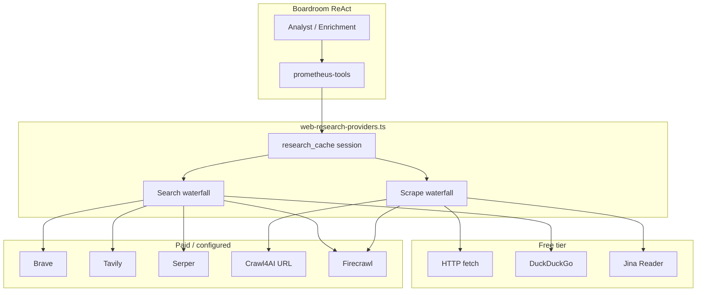

# Prometheus Research Gateway — Design Spec

**Date:** 2026-06-13  
**Status:** Draft — awaiting user review  
**Scope:** Unificar pesquisa web do boardroom Prometheus com o mesmo modelo de infra do motor de código (chaves configuráveis, free-first, paid fallback).

---

## Problem

Hoje o boardroom chama **apenas** `firecrawl-search` / `firecrawl-scrape` via `prometheus-tools.ts`. Sem `FIRECRAWL_API_KEY`, a pesquisa degrada para vazio — mesmo existindo `web-research-providers.ts` no runtime do forge com Brave, Tavily, Serper, DuckDuckGo, Jina e HTTP direto.

O usuário quer o **mesmo princípio do motor de código**: configurar provedores (Brave, Tavily, Serp, Firecrawl, Crawl4AI), priorizar opções gratuitas (HTTP fetch, busca free), só gastar API paga quando necessário, com cache persistente.

---

## Goals

1. **Free-first:** HTTP direto no link → depois provedores pagos com chave do usuário/plataforma.
2. **Multi-provider search:** Brave, Tavily, Serper, Firecrawl, DuckDuckGo (free weak fallback).
3. **Multi-provider scrape:** HTTP → Jina Reader (free) → Crawl4AI (self-hosted URL) → Firecrawl (paid).
4. **Configuração flat em /api:** cards por provedor + API key, igual LLM/E2B — não só Firecrawl.
5. **Cache:** `research_cache` por sessão (já existe) + TTL opcional em tabela `research_cache_entries` (fase 2).
6. **Qualidade:** LLM recebe snippets + URLs; pode fazer N fetches HTTP nos top links antes de pedir scrape pago.

## Non-goals (v1)

- Instalar Crawl4AI **dentro** do Edge Runtime Deno (impossível — Python).
- Substituir `tenant_secrets` do editor de agentes (continua para tools do agente publicado).
- UI de preferência por usuário final não-admin (v1 = platform_secrets admin + auto waterfall).

---

## Current State (audit)

| Camada | Hoje | Gap |
|--------|------|-----|
| `web-research-providers.ts` | Brave/Tavily/Serper/Firecrawl/DDG search; HTTP/Jina/Firecrawl scrape | **Não usado pelo Prometheus** |
| `prometheus-tools.ts` | `research_web` → `firecrawl-search`; `fetch_page` → `firecrawl-scrape` | Bypass do provider chain |
| `web-research-tools/index.ts` | Shim só Firecrawl | Legado |
| `MotorInfraSection.tsx` | Só `FIRECRAWL_API_KEY` | Falta flat providers |
| `platform-secrets-api.ts` | Tipo só Firecrawl | Falta union de chaves |
| `admin-platform-secrets` | ALLOWED_NAMES sem Brave/Tavily/Serper | Bloqueia cadastro |

---

## Recommended Approach: **Unified Gateway Module (in-process)**

Reutilizar e estender `web-research-providers.ts` como **única fonte de verdade**. Prometheus, tool-executor e edge shims importam o mesmo módulo — sem novo hop de rede entre funções edge.

### Why not a new edge function?

- Latência extra em cada step do ReAct (6–8 calls/sessão).
- O módulo shared já roda no mesmo isolate do `prometheus-builder`.
- Menos deploy surface.

### Why not Crawl4AI embedded?

- Crawl4AI é Python + browser; roda como **serviço HTTP opcional** (`CRAWL4AI_BASE_URL`).
- Plataforma ou usuário aponta URL (Docker local, Railway, etc.).
- Boardroom usa HTTP/Jina primeiro; Crawl4AI só se URL configurada e HTTP falhou.

---

## Waterfall Strategy

### Search (`research_web`)

```
1. research_cache hit (session)     → return cached
2. DuckDuckGo (free, sync)          → if ≥2 results, return
3. User/platform keys (auto order):
   a. BRAVE_SEARCH_API_KEY
   b. TAVILY_API_KEY
   c. SERPER_API_KEY
   d. FIRECRAWL_API_KEY (last paid)
4. Empty degradado                  → { results: [], note: "configure search key" }
```

**Regra de custo:** nunca chamar Firecrawl se Brave/Tavily/Serper retornou resultados.

**Qualidade:** após search, opcionalmente auto-fetch HTTP dos top 2 URLs (free) e anexar `page_excerpt` ao cache.

### Scrape (`fetch_page`)

```
1. session cache (url key)
2. HTTP direto (User-Agent, strip HTML, 50k cap)     → free
3. Jina Reader (r.jina.ai)                            → free tier
4. CRAWL4AI_BASE_URL /crawl (se configurado)          → self-hosted free
5. FIRECRAWL scrape                                   → paid last resort
```

**Regra:** logar `provider` em cada turn para transparência no chat boardroom.

---

## Configuration Model

### Platform secrets (`platform_secrets` + `/api` Motor Infra)

| Secret | Provider | Tier |
|--------|----------|------|
| `BRAVE_SEARCH_API_KEY` | Brave Search | Paid (user key) |
| `TAVILY_API_KEY` | Tavily | Paid |
| `SERPER_API_KEY` | Serper (Google) | Paid |
| `FIRECRAWL_API_KEY` | Firecrawl search+scrape | Paid (fallback) |
| `CRAWL4AI_BASE_URL` | Crawl4AI HTTP API | Free (self-hosted) |

Sem chave = waterfall pula esse degrau. HTTP + DuckDuckGo sempre disponíveis.

### UI: `MotorInfraSection` v2

- Grid flat: um card por provedor (ícone, status configurado, link docs, `ApiKeyInput`).
- Seção **"Pesquisa web"** separada de **"LLM"**.
- Badge: `free-first ativo` quando nenhuma chave paga (mostra HTTP+DDG).
- Texto: "O motor tenta HTTP gratuito antes de usar chaves pagas."

### Tenant secrets (editor agente)

Mantém override por agente publicado (`tenant_secrets`) — já usado por `tool-executor` para `web_scrape`/`web_research`. Prometheus boardroom usa **platform_secrets** primeiro; tenant override em fase 2 se `userId` tiver secrets próprios.

---

## Architecture



---

## Implementation Plan (high level)

### PR1 — Wire Prometheus to gateway (P0)

- `prometheus-tools.ts`: `researchWeb` / `fetchPage` chamam `researchWebQuery` / `scrapeWebPage` com secrets de `getPlatformSecrets()`.
- Reordenar waterfall: **HTTP/DDG antes de paid** (alterar `web-research-providers.ts` ordem `auto`).
- Remover dependência hardcoded de `firecrawl-search` edge functions no path Prometheus.
- Turn metadata: `{ provider, from_cache, cost_tier: "free"|"paid" }`.

### PR2 — Platform secrets + UI (P0)

- Expandir `ALLOWED_NAMES` em `admin-platform-secrets`, `admin-secrets-map`, `platform-secrets-api.ts`.
- Refatorar `MotorInfraSection` → cards flat para 5 provedores + Crawl4AI URL.
- Atualizar smoke: passa com zero chaves (HTTP+DDG).

### PR3 — Quality boost (P1)

- Pós-search: auto `fetch_page` HTTP nos top 2 URLs, merge no cache.
- Limite: max 3 search + 4 fetch por sessão (budget guard no ReAct).
- Exibir no chat: "Pesquisa via brave (3 resultados)" / "Página lida via http".

### PR4 — Crawl4AI adapter (P1)

- `scrapeViaCrawl4AI(baseUrl, url)` → POST `{ url }` ao serviço.
- Doc: docker run crawl4ai com API wrapper (script de referência em `scripts/crawl4ai-server/`).
- **Não** auto-install no edge; opcional platform URL.

### PR5 — Persistent cache (P2)

- Tabela `research_cache_entries (hash, payload, expires_at)` para hits cross-session no mesmo domínio.

---

## Alternatives Considered

### A — New `research-gateway` edge function

- **Pro:** boundary clara, rate limit centralizado.
- **Con:** +1 round-trip por tool call; mais cold starts.
- **Verdict:** rejeitado para v1; considerar se rate limit global necessário.

### B — E2B sandbox com Crawl4AI pré-instalado

- **Pro:** scrape pesado (JS render) de qualidade.
- **Con:** latência 30s+, custo E2B, async — ruim para boardroom síncrono.
- **Verdict:** fase futura para agente publicado, não boardroom planning.

### C — Só expandir Firecrawl UI

- **Con:** não resolve free-first nem multi-provider.
- **Verdict:** rejeitado.

---

## Testing

- Smoke: prompt prospect/advogados **sem nenhuma API key** → `research_cache` ou turns com `provider: http|duckduckgo`.
- Smoke com `BRAVE_SEARCH_API_KEY` → `provider: brave`, Firecrawl não invocado.
- Unit: waterfall order mocked; empty paid → fallback free.
- Manual: /api cadastrar Brave → boardroom mostra fontes reais.

---

## Open Questions

1. **Ordem default paid:** Brave → Tavily → Serper → Firecrawl — ok ou preferência configurável na UI?
2. **Crawl4AI:** plataforma hospeda uma instância shared ou só URL self-hosted do admin?
3. **Tenant override:** boardroom usa secrets do usuário dono do agente em v1 ou só platform?

---

## Approval

Após review deste spec → `writing-plans` skill para PR DAG detalhado.